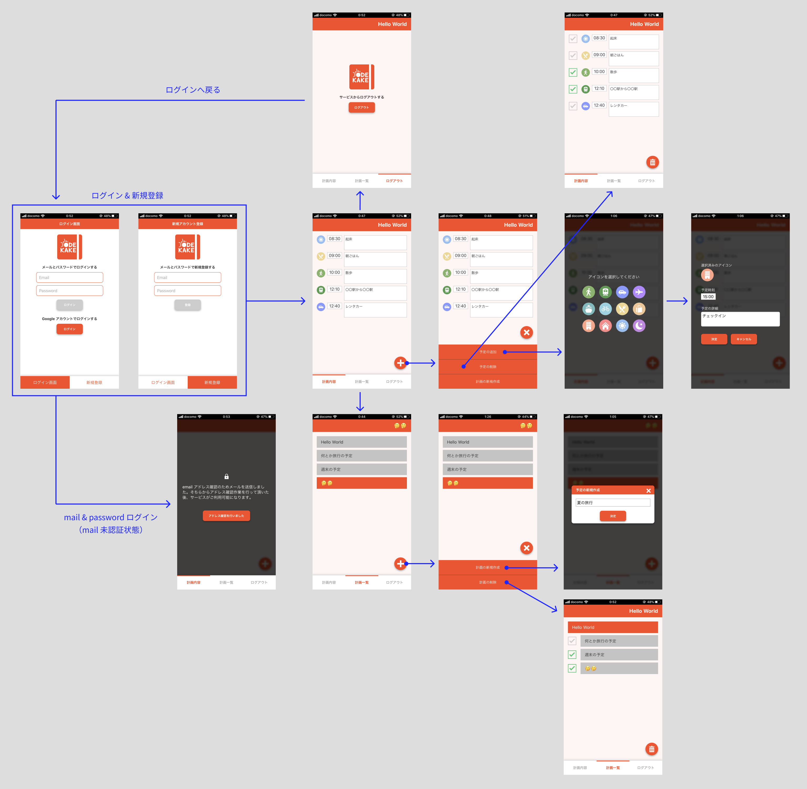
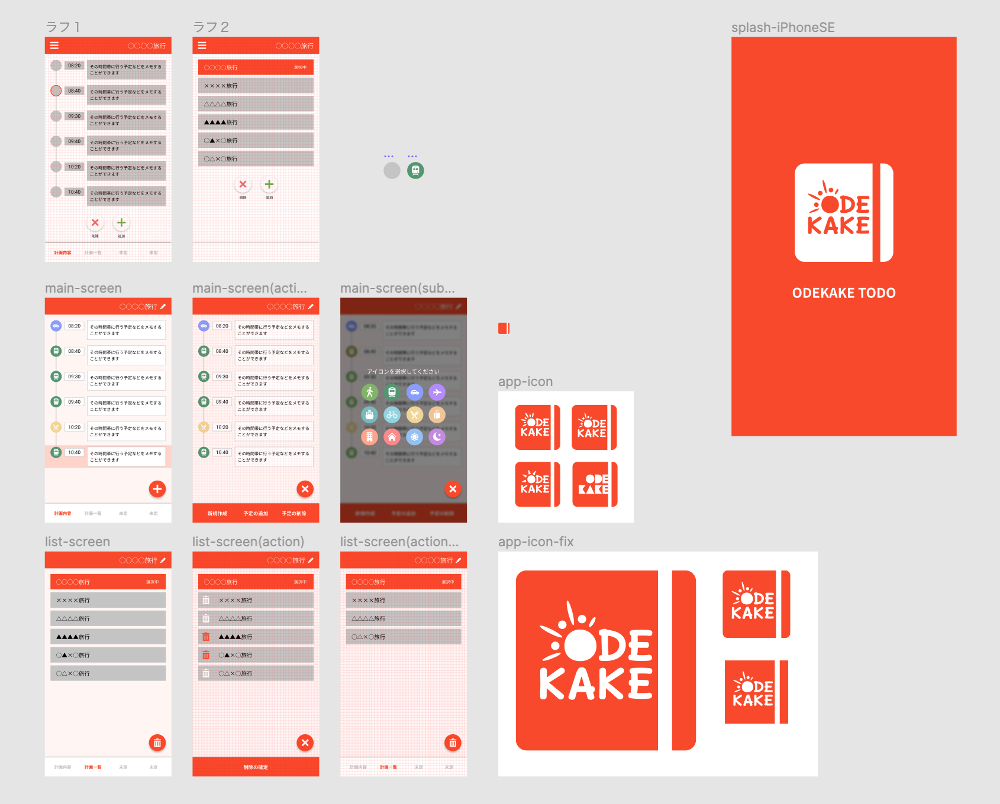

# FirebaseとNuxtでWebアプリ (SPA/PWA) を個人開発。その過程での学び等々を紹介

## この記事について

個人開発でのデザイン〜実装までの工程について触れていきます。  
文字も多く長めの記事になりますので、この記事で触れる要素を大小関わらず先に記載しておきます。

* 個人開発物（Webアプリ）の紹介
* アプリケーションのデザインについて
* Atomic Design についての個人的見解
* コンポーネントの粒度について
* 状態管理について
* Firebase（主に CloudFireStore / Auth 部分）
* SPA 実装について所感

## 個人開発アプリケーションの紹介


アクセスは上記QRコード or https://first-project-42ca3.firebaseapp.com  
※ __スマホでの閲覧推奨__。PCでも閲覧、操作可能ですが一切考慮していません  
※ __PWA なのでホーム画面追加を推奨__  
※ 第三者へ個人情報の提供等は致しません

ODEKAKE TODO（お出かけTODO）というWebアプリケーション（PWA）を個人開発しました。名前の通りお出かけの予定を立てるためのアプリケーションになります。コンセプトとしては「お出かけ」を重点においたアプリケーションですが、現時点の機能ではただの TODO 作成アプリケーションです😅  
一旦次に開発したいモノがあるので、今後「お出かけ」の要素を追加実装していけたらと思います。

簡易な画面遷移図で紹介すると下記の様なイメージのアプリケーションになります。



## ① Figma で大雑把にベースイメージのデザイン

まず個人開発を始めるにあたって、作りたいモノ（お出かけの予定を立てるためのアプリケーション）は決まっていたので、ベースとなるイメージのデザインから始めました。今回そんなに細かいグラフィックを制作するつもりは無かったので [Figma](https://www.figma.com/) というツールでベースイメージは完結しました。  

イメージはコーディングによる画面実装の指標程度に作成し、実際の画面はコーディングを進める中で UI の細かい見た目や動きの調整、ベースイメージに無い（足りない）画面の実装等を行い完成した成果物になります。

下記がコーディングの指標のため作成したベースイメージです。



### 色と UI について

今回作成したアプリケーションはテーマカラーとして「パッションオレンジ（彩度強めのオレンジ）」を設定。コンセプトである「お出かけ」は即ち外に出る行為を表します。散歩、買い物、旅行などそれら全て該当しますが、いずれにしても、予定を組み立て上向きな気持ちでアクティブにその日の「お出かけ」を楽しみたいものです。そのような「ポジティブで元気（活動的）な様子」に合うようなテーマカラーとして「パッションオレンジ」を置きました。

UI については可読性や押しやすさ等を考慮しながら基本シンプルに作成しましたが、アプリケーションの操作に一貫性を持たせたかったので、そのページでのアクション（機能）が全て「右下の丸ボタン」から始まるような設計を意識して作成しました。

### ロゴについて

ロゴは角丸の四角形の右側に一本縦線が入って「手帳」を模している。これは本Webアプリのコンセプトである「お出かけ」の予定を立てる為の「手帳」を表しています。ロゴタイプはアルファベットの O を太陽に見立て、フォント自体はカッチリしたゴシック体ではなく、少し手書き感のあるような柔らかい丸ゴシックを選んでいます。これは「お出かけ」という言葉を使うシチュエーションを想像した時に、そのワードに「気さくで柔らかい印象」を感じた事が理由になります。

## ② 技術選定

本アプリケーションの開発目的は「学習」がメインであり、使用技術＝学習項目となります。結果として下記項目の技術を使用してアプリケーションを作成する事にしました。

* Firebase（Auth / Functions / Hosting / CloudFireStore）
* Nuxt（Vue）/ SSR
* PWA

## ③ コンポーネント設計

主に Vue Component の設計をどうするか...という点がメインになります。  
Vue を使ってアプリケーションを開発する理由としてコンポーネント指向で実装していく知見の獲得であったり、ベストプラクティスを探っていく事が目的となります。真っ先に思いつくのが「Atomic Design」ですが、こちらは今回見送ることにしました。

### 何故 Atomic Design を採用しなかったか

[Atomic Design](https://uxdaystokyo.com/articles/glossary/atomic-design/) について詳しく解説はしませんが、主な理由は下記になります。

* かなりコンポーネントの粒度（区分）が細かいので、厳密にルールが定められていないと正しい区分に振り分けることができない（ある意味縛りプレイでの開発になってしまい苦しい）
* 学習目的がメインの開発だが、１つのアプリケーション開発に学びたい事を詰め込みすぎると破綻する未来が見えた（特に Atomic Design は重い）
* 規模的に Atomic Design を当てはめるほどか？と言われればそうでも無いと感じたため

### Atomic Design の代替として採用した区分

結局の所 Atomic Design とはコンポーネント管理の指針を定める役割や、コンポーネントの肥大化を防ぐことで汎用性を高めることが１つの大きな目的だと私は思います。その思想自体は活かしたい所なので、もっと大雑把な区分で分ける事にしました。具体的には下記の様なコンポーネントの区分分けとしました。

```bash
src
...
├── components
│   ├── mix     # ▼ 機能重視
│   │   ├── mix-action-controllers.vue
│   │   ├── mix-icon-selection-screen.vue
│   │   ├── mix-lock-screen.vue
│   │   ├── mix-todo-item.vue
│   │   ├── mix-todo-list.vue
│   │   └── mix-todoname-popup.vue
│   └── single / # ▼ 汎用性重視
│       ├── add-button.vue
│       ├── app-button.vue
│       ├── app-footer.vue
│       ├── app-header.vue
│       ├── app-loading.vue
│       ├── app-logo.vue
│       ├── check-icon.vue
│       ├── circle-icon.vue
│       ├── delete-button.vue
│       ├── modal-screen.vue
│       ├── todo-textarea.vue
│       └── todo-time.vue
...
```

ディレクトリの命名センスはさておき...
__mix__ と __single__ という区分けでコンポーネントを管理し、下記ルールに従ってコンポーネントを作成するようにしました。（殆どの下記に準じて開発しましたが、ほんの一部リファクタ漏れもあり例外もあったりします）

#### mix/

機能重視のコンポーネント。他の mix-* Component と Vuex を通じて機能連動（依存）していたりする。

* 自身以外に１つ以上他のコンポーネントを import する
* 特定のページでしか使わない場合でも作成可能
* Vuex にデータを持つ事が許される
* ページで使用される機能やロジックは基本内部で持たず props 経由で event として渡す（ただし特定ページ限定のコンポーネントであり、大きな役割を担う場合は例外)

#### single/

汎用性重視のコンポーネント。様々な箇所で使われる想定。

* 他のコンポーネントを import せず、自身が唯一のコンポーネントである
* 基本ページ内もしくは複数ページで２回以上使い回される場合に作成
* Vuex にはデータを持たせない
* ページで使用される機能やロジックは内部で持たない
* コンポーネント自身が持つべき見た目の振舞に関する状態と機能は持たせて良い（ただし状態等は props から変更が可能であること）

#### 余談 Atomic Design ついて思う事

Atomic Design と聞くとフロント開発において近年特に盛んなワードの１つのように思います。Atomic Design とはコンポーネント指向な設計思想なので、視覚的な表示面で言えば Webサイト内での UI の一貫性を保つ事に寄与します。それは Webデザインにおいても良い事だと私は思います。しかし、その反面デザイナー側に表現面で制約を課す事にも繋がると思っています。あまり良い言い方ではありませんが、保守性や汎用性といった合理性に基づくシステマティックな設計をフロント側で実現するため、デザイナーを納得させる便利なユビキタス言語（共通言語）だと私は感じる事があります。

私の偏見になりますが、特にフロント側のエンジニアは「モダン」な設計や開発を好む傾向にある印象を私は抱いています。個人の市場価値やキャリアパス、モチベーションにも関わってくるため、携わるなら「モダン」な設計や開発をしたいのは私含め多くの方が思うのではないでしょうか。

結論として言いたいのは、Atomic Design を実現するためにはフロント開発者とデザイナー間でしっかりコミュニケーションを取りメリット、デメリットを踏まえた上で採用する必要があるでしょう。

## ④ 実装について

本項では実装方法よりも実装を進める上での悩みや躓き、それらに対してのアプローチ等を紹介していきます。

### Nuxt × Firebase での実装 + PWA

Nuxt × Firebase での実装は既に沢山の方々が記事で紹介されている事もあり、同じ量産記事になってしまうため省略します。知りたい方は下記が参考になると思います。（少し古めの記事なので、nuxt のセットアップ方法等が多少異なりますが、手順としては大筋変わりません）

* [Nuxt.jsとFirebaseでSPA×SSR×PWA×サーバーレスを実現する](https://inside.dmm.com/entry/2018/04/10/nuxt-firebase)

PWA の細かい設定等は下記が参考になると思います

* [PWAに必要な最小個数のアイコンサイズについて](https://webty.jp/staffblog/production/post-696/)
* [iOS端末のPWAスプラッシュ画面設定](https://qiita.com/NaokiIshimura/items/2b18ce82c936399b695c)
* [SEOに必要なmetaとogpの設定及びpwa(Manifest、Icon、Workbox)の設定](https://qiita.com/amishiro/items/e668be423a85c2b61696)

### Vue Component の役割や粒度の切り分け

mix と single という区分でコンポーネントを切り分けするようにしましたが、実際はコーディングを進めていく中で mix と single でコンポーネントが持つ責務の範囲を詳細に決めていきました。

設計の段階では Vue での実装経験が薄い事から見えていなかった部分も多く、実際に実装を進めるとコンポーネントが汎用性を失う要因などが見えてくるようになりました。幾つか汎用性を向上させる例とその理由を簡単に記載します。

* click で発生するイベントはコンポーネントでは持たず、外から `@click.native` や `props` で渡す。コンポーネントで特定のイベントを持ってしまうと、他ページでそのイベントが不要な場合そのコンポーネントは使えなくなってしまう。ただしコンポーネント自身が click により一定の表示へ切り替わるような仕様の場合、その切り替え表示を行う自身に関わるイベントは持たせても良い
* 汎用性を重視したコンポーネントは Vuex を使用しない。理由としては単純で Vuex ありきのコンポーネントになってしまい、そのコンポーネントを使用する場合 Vuex が必要になってしまう
* 複数の UI から構成された UI ではなく、単一の UI をコンポーネント化する。見た目上の話「ボタン」と「テキストエリア」を組み合わせた UI をコンポーネントとした時、他ページで「ボタン」だけを使いたい場合に使用できない。単一の UIしか持たない コンポーネントは、Atomic Design で言うならば一番小さい Atoms にあたる

### 状態管理について

今回は CloudFireStore で Webアプリケーションの状態管理を行なっているので、そもそも client 側で二重に状態管理を行う必要があるのか。その他 CloudFireStore 側の状態管理（remove/update）の処理を何処に書くべきなのか非常に悩みました。

結論としては CloudFireStore と client で二重状態管理を行い、CloudFireStore の処理は client 側の状態管理と同じく Vuex に書くようにしました。二重で状態管理を行う理由としては client 側でも状態を保持する為、ユーザーが操作を行なっている間は CloudFireStore からデータを取得する必要なく、通信（Read）を削減でき、パフォーマンス面でも良い UX の提供を期待できる点にあります。

CloudFireStore 処理の記載場所については、client 側の状態管理は Vuex で行なっている為、その client 側と状態を合わせる事を考えると Vuex に処理を書くほうが都合が良かったりしました。また、状態管理に関するロジックは CloudFireStore, client 問わず一箇所で扱った方が煩雑になりづらいという点から Vuex へ CloudFireStore の処理を書くに至りました。

#### 二重の状態管理が辛い点

CloudFireStore と client の二重状態管理で辛いのは、常に CloudFireStore 側と client 側で同じ状態を保持する必要がある点です。両者同じ状態を担保するのは実装面でもかなりコストです。もしも両者で保持している状態にズレが発生すると下記のような事（例）が起こり得ます。

ユーザーが何らかの操作を行い表示上の Item が 3つになったとします。この時 client 側は Item を３つ保持している状態です。同じく CloudFireStore 側の Item 保持数も３つである必要がありますが、もし２つだった場合に問題が起こります。ユーザーがページをリロード等した時、CloudFireStore 側からデータを取得する為、Item の表示数は２つとなってしまいユーザーに混乱をさせてしまいます。

### CloudFireStore での悩みとセキュリティールール

CloudFireStore 基本的なデータ構造については説明しませんので、知りたい方はこちら [Cloud Firestore データモデル](https://firebase.google.com/docs/firestore/data-model?hl=ja) をご覧ください。

#### CloudFireStore のデータ構成

正直 CloudFireStore（DB）でのデータ構成は手探りでした。CloudFireStore の構造は独特だと思いますが、そもそも DB の設計には全くといって精通していないので、これでいいのか...？という感じで進めていきました。

とりあえず留意した事としては、１つのドキュメントに多くのデータを持たせ過ぎないようにすること。CloudFireStore は１つのドキュメントに対して連想配列のようにデータを持たせる事が可能です。なので階層を深くすれば多くのデータを１つのドキュメントに持つ事ができます。

しかし、１つのドキュメントが持つデータが多いとドキュメント単位でデータを取得する際に、そのページでは必要のない無駄なデータまで取得することになります。
なのでコレクション配下のドキュメントとは別に、サブコレクション配下にもドキュメントを持つようなデータ構造で設計しました。

```bash
# Document（データA）を取得する際に SubCorrection 配下の Document（データB）は取得されない
Correction/
└── Document（データA）
    └── SubCorrection/
        └── Document（データB）
```

しかしながら、基礎中の基礎のような使い方しかできていない為、CloudFireStore に限らず DB の設計についてもう少し詳しくなる事が今後の自分の課題の１つでもあります。

#### ドキュメントの配列フィールドに関して

CloudFireStore ではドキュメントに対して下記のような構造でデータを持たせる事ができます。同じく自分のアプリケーションでも下記のようにドキュメントに対してデータを持たせている部分があるのですが、１つ困る事に遭遇しました。

```js:
Document = {
    todoList: [
        {
            name: 'クリスマスの予定',
            docid: 'unique01'
        },
        {
            name: '正月の予定',
            docid: 'unique02'
        },
    ]
}
```

この配列フィールドですが、配列データを更に追加することや、削除することはできます。しかし、もう既に配列に存在する特定の値を UPDATE する事が不可能でした。  
厳密に言えば不可能ではないのですが、Array のフィールドを全て書き換える方法になってしまいます。Array だと値に対する key 名で悩む必要もないので安直に Array でフィールドを作ってしまいましたが、後々上記のような事に遭遇し困りました。

下記、同じような問題の参考URLになります。

* [StackOverFlow : Firestore Update single item in an array field](https://stackoverflow.com/questions/52187985/firestore-update-single-item-in-an-array-field)
* [StackOverFlow : How to update individual array element in firebase...](https://stackoverflow.com/questions/53845632/how-to-update-individual-array-element-in-firebase-with-ios-swift)

#### セキュリティールール

普段フロント側の実装に従事している身としては、セキュリティーと聞くと難しいイメージがありました。なので CloudFireStore のセキュリティールールも同様に最後まで後回しにしていました。

しかし、実際セキュリティールールを書き始めてみると案外すんなり書く事ができました。
セキュリティールールのシュミレーターも Firebase のコンソール（GUI）で用意されており、これが凄く便利でした。書いたセキュリティールールに乗っ取って、意図する通りに特定ユーザーのリクエストを弾けているかシュミレートできるので検証をスムーズに行う事ができました。

下記が実際に書いたセキュリティールールになります。  
基本的ではありますが、認証済みでメール確認も済んでいるユーザ自身のドキュメントに対してだけ read/write どちらも許可するようにしています。  
テストアカウント（test-account@test.com）に対してはメール確認のチェックを行わないようにしています。

```js
rules_version = '2';
service cloud.firestore {
  match /databases/{database}/documents {
    function isAuthenticated() {
      return request.auth != null;
    }

    function selfCheck(userId) {
      return request.auth.uid == userId;
    }

    function verifyEmail() {
      return request.auth.token.email_verified
          || request.auth.token.email == 'test-account@test.com';
    }

    match /todoItem/{userId}/{document=**} {
      allow read, write: if isAuthenticated() && selfCheck(userId) && verifyEmail();
    }
  }
}
```

下記、セキュリティールールを書くのに参考になるURLになります。

* [Qiita : Firestoreのルールシミュレーターを使ってみる](https://qiita.com/sgr-ksmt/items/a9032557aba9fd2f7843)
* [Cloud Firestoreの勘所 パート3 — セキュリティルール](https://medium.com/google-cloud-jp/firestore3-9518331f8748)
* [公式 : Cloud Firestore セキュリティ ルールを構造化する](https://firebase.google.com/docs/firestore/security/rules-structure?hl=ja)

### Firebase Authでの躓き

Firebase を使った認証は驚くほど簡単でした。  
しかしその反面、実装を進めるうちに躓いたことが幾つかあったのでご紹介します。

#### firebase.auth().currentUser

Firebase の認証を使っている方なら一度はハマった事があるのではないでしょうか。  
認証済みであるハズなのに、`firebase.auth().currentUser` で null が帰ってくる現象です。
端的に説明すると、ユーザーが認証済みであっても firebase.Auth オブジェクトの初期化が完了するまでは null が帰ってくるので、認証の確認には `firebase.auth().onAuthStateChanged()` の使用が好ましいです。

#### firebase.auth().onAuthStateChanged()

ユーザーの認証状態の変更を監視するメソッドです。このような監視系のメソッドで躓くのは大体処理の重複等であったりします。`onAuthStateChanged()`も例外ではなく、実行される度に処理の重複が起こる事を確認しました。

下記コードは `onAuthStateChanged()` による処理の重複例と、重複の解消例になります。  

```js
/**
 * mounted が３回実行されたとしたら、
 * 認証状態に変更があった時 'hello' が３回コンソールに出力される
 */
mounted() {
    firebase.onAuthStateChanged(user => {
        console.log('hello')
    });
}
```

```js
mounted() {
    const unsubscribe = firebase.onAuthStateChanged(user => {
        console.log('hello');
        unsubscribe() // onAuthStateChanged の監視を終了する
    });
}
```

Firebase の公式ドキュメントでは `unsubscribe()` の使用例は見当たりませんでしたが、メソッドのリファレンスで `onAuthStateChanged` の return として `firebase.Unsubscribe` が返る事がしれっと記載されています。

下記参考になったURLになります。

* [StackOverFlow : Firebase onAuthStateChanged unsubscribe recursion](https://stackoverflow.com/questions/47043188/firebase-onauthstatechanged-unsubscribe-recursion/47043249)
* [firebase 公式 : onauthstatechanged](https://firebase.google.com/docs/reference/js/firebase.auth.Auth.html#onauthstatechanged)

#### メール認証

[sendEmailVerification](https://firebase.google.com/docs/reference/js/firebase.User.html#sendemailverification) により送信されたメールをユーザーが確認する事で、[User](https://firebase.google.com/docs/reference/js/firebase.User?hl=ja) 情報の `emailVerified` というプロパティーが `true` となります。メール確認後 client 側に関してはリロードすれば User 情報の `emailVerified` は `true` に変更されました。  

しかし、何故か CloudFireStore 側の User 情報（`emailVerified`）が更新されず `false` のままなのでセキュリティールール上 GET リクエストができないという現象に遭遇しました。  
再認証（ログイン）すれば解消できるのですが、これではユーザビリティーを損なってしまいます。

この解決方法としては、client 側で `emailVerified` が `true` に変更された後、[getIdToken(true)](https://firebase.google.com/docs/reference/js/firebase.User.html#getidtoken) を実行する事でした。メール確認が行われた事を知るために CloudFireStore には更新された新しい token が必要になります。`getIdToken` の引数を `true` とする事で、強制的に新しい token へ更新する事が可能です。再認証で問題が解決したのも新しい token の発行が理由です。

下記、同じ問題を発見して解決に至りました。

* [StackOverFlow : Firebase firestore not updating email verification status](https://stackoverflow.com/questions/50894869/firebase-firestore-not-updating-email-verification-status)

## SPA Webアプリケーションを作ってみての所感

なんだかんだ SPA の開発は考える事が多いのでコストがやっぱりかかるな〜というのが私の第一の感想です。SPA 機能の実現自体はフレームワークが良い感じにしてくれますが、コンポーネント設計が入ってくると汎用性だったりコンポーネント化する粒度（範囲）だったりを考慮して実装を進める必要があリます。

その他 SPA だとページ間でデータを共有しているので、そのデータを変更するようなロジックを組んだ時に影響範囲が場合によっては広いです。そのため新しく処理を追加するのに慎重になります。こういった部分でどうしても開発速度が落ちるなーという印象を受けました。

コンポーネント設計に関しては、ある程度実装前のフェーズできちんと設計を行なったり、自分自身の中で設計のプラクティスが確率できているのなら多少開発速度を担保できそうだと感じました。  
このように前述ではコストがかかるな〜というネガティブな印象を述べましたが、反面それに見合うメリットも感じられました。項目形式でいくつか挙げます。

* シームレスなページ遷移の実現によりネイティブアプリのようなスムーズな表示や操作性をユーザに提供する事ができる
* スタイル（CSS）のカプセル化を行う事ができ、安易なclass名によるページ全体へのスタイルの影響を考える必要がほぼ無くなる
* DOM 操作を行う Script を書く頻度が減る。生の JavaScript で UI の表示を変更するような処理を書けなくても、Vue のようなフレームワークなら書ける人もいそう
* サーバーサイドは API から結果を返すだけでいいので、フロントとサーバーサイド側の役割（責務範囲）が明確になる

上記のようにユーザーに対して UX 面でのメリットがあるだけでなく、開発面にもたらすメリットも大きいです。実装要件によって SPA が合う合わない等あるかと思いますが、ある程度コストを掛けて開発する事が許されるのであれば、SPA の開発を検討する価値は大いにあると思います。

## 雑談

最初に断っておくと、何の実りも無いただの雑談ですので読み飛ばして頂いても結構です。

この個人開発ですが、実は最初のコミット 2019/01/19 から亀のような速度で進めること10ヶ月にしてようやく一旦完成と言える状態になりました。色々寄り道しながら開発していた事もあり、物凄く時間が掛かってしまいましたが途中で投げ出さす一旦完成状態まで持って行けたので自分自身へ良く頑張った！と褒めておきます。

開発初期 nuxt のバージョンは 2.3.4 でしたが、今や最新のバージョンは 2.11.0（本アプリは開発途中に一度アップグレードを行い現在 2.8.1）です。そう思うと技術進化の流れをとても早く感じます。

ここで個人開発の苦労話を１つ話します。私は「英語」が得意ではないので、本アプリケーションの個人開発においてコミット文書を全て「英語」で書くという縛りで開発を行いました。なので毎回コミットの度に英文に悩まされ、ひどい時はコミットに1時間近く要すこともありました（笑）  
多分英語をスラスラ読み書きできる方からすれば酷いコミット文なんだろうな......と思いつつ、多少は英文慣れするという意味合いでは役に立ったと思います。  
私と同じように英語が得意ではない方も是非 try してみてください。
