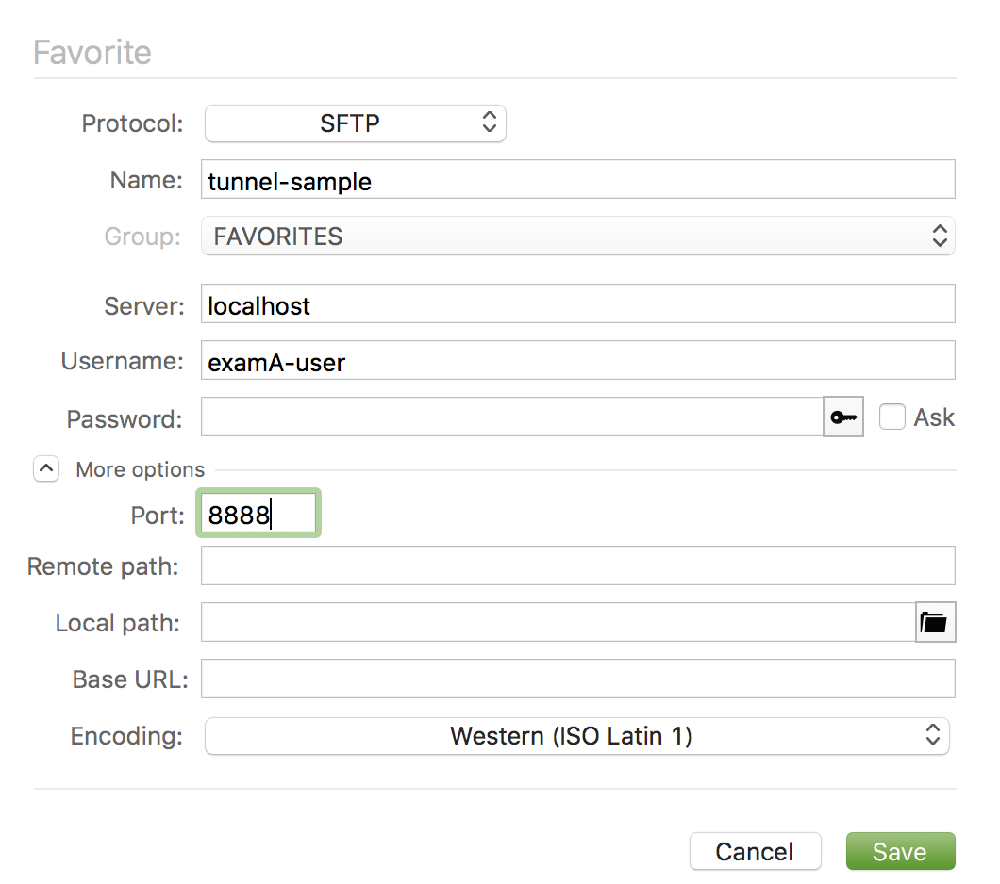

# ssh 接続についてメモ

* 基本的な ssh 接続の方法
* ローカルポートフォワード

## ssh 接続の基本

下記コマンドで ssh での接続を行います。

```bash
# デフォルトではポートが22番。.ssh 配下に認証鍵が存在する場合は id_rsa がデフォルトで使用される
ssh <ユーザ名>@<接続先host>

# user_name をオプションの形で書く
ssh <接続先host> -l <ユーザ名>

# あえてポート番号と認証鍵を指定する
ssh <ユーザ名>@<接続先host> -p 22 -i ~/.ssh/id_rsa
```

## ローカルポートフォワード（トンネリング）

localhost から目的のサーバーへ接続可能な状態（トンネル）を作成する。  
SFTP でプロキシ経由でないと接続できないサーバーにデータ転送するなどに便利です。

参考ドキュメント

* [SSH によるポートフォワーディング](https://blue-red.ddo.jp/~ao/wiki/wiki.cgi?page=SSH%A4%CB%A4%E8%A4%EB%A5%DD%A1%BC%A5%C8%A5%D5%A5%A9%A5%EF%A1%BC%A5%C7%A5%A3%A5%F3%A5%B0)
* [SSH でトンネリング](https://nksg.org/archives/13)
* [SSHポートフォワード（SSHトンネル）](https://www2.filewo.net/wordpress/2019/03/31/%e3%80%90%e6%94%b9%e8%a8%82%e7%89%88%e3%80%91ssh%e3%83%9d%e3%83%bc%e3%83%88%e3%83%95%e3%82%a9%e3%83%af%e3%83%bc%e3%83%89%ef%bc%88ssh%e3%83%88%e3%83%b3%e3%83%8d%e3%83%ab%ef%bc%89%e3%80%90%e3%83%ad/#i-2)

### コマンドオプション

|オプション|効果|
|--|--|
|-L|<任意ポート>:<ホスト>:<ホストポート> で指定<br>任意ポート → ホストポートへ接続の為のトンネルを作成
|-N|リモート（接続先）で何もコマンド実行しない|
|-f|バックグランド実行（単体では使用できないので -N とセットで使用）|

### 基本コマンド

```bash
# -L オプションで <任意のポート番号> から <hostA>:<特定ポート番号> への接続を可能にする
# <ユーザ名>@<hostB> -i <認証鍵> は中継となるホストへの接続情報
ssh -L <任意のポート番号>:<hostA>:<特定ポート番号> <ユーザ名>@<hostB> -i <認証鍵>
```

### ローカルポートフォワード例

* 中継ホストの examB.com には examA.com の認証鍵（id_rsa）がある状態
* `-i ~/.ssh/id_rsa` と指定しているが、認証鍵がある場合デフォルトで id_rsa が使用されるので、無くてもOKなはず

```bash
# ① localhost:8888 から examA.com:22 に接続を可能にする（トンネル作成）
ssh -f -N -L 8888:examA.com:22 userA@examA.com -i ~/.ssh/id_rsa
# ② localhost:8888 から examA.com:22 に接続
ssh userA@localhost -p 8888 -i ~/.ssh/id_rsa
```

```bash
# ① localhost:8888 から userB@examB.com を跨いで userA.com:22 に接続を可能にする（トンネル作成）
ssh -f -N -L 8888:examA.com:22 userB@examB.com -i ~/.ssh/id_rsa
# ② localhost:8888 から examA.com:22 に接続
ssh userA@localhost -p 8888 -i ~/.ssh/id_rsa
```

#### コネクションの切断

-f -N をつけてローカルポートフォワードした場合、exit コマンドでプロセスを終了できないので、  
プロセスのPIDを kill する必要があります。

```bash
# ① 実行中のプロセス（PID）を grep ssh で絞って調べる
ps aux | grep ssh
# ② 該当の PID を kill（切断）する
kill -9 <PID>
```

### SFTP 設定例

前提

* 中継ホストの examB.com には examA.com の認証鍵（id_rsa）がある状態
* examB.com から examA.com への接続はパスフレーズ無し
* examA.com への接続ユーザー名は [examA-user]

#### ① トンネルの作成

localhost:8888 から examA.com:22 へデータ転送可能にする

```bash
ssh -f -N -L 8888:examA.com:22 userB@examB.com -i ~/.ssh/id_rsa
```

#### ② SFTP の設定

* Proticol: SFTP
* Server：localhost
* Username: examA-user
* Port: 8888

上記のように設定を行うことで SFTP で examA.com へファイル反映できるようになるはずです。  
※ examB.com から examA.com のssh接続設定がパスワード認証だった場合や、鍵認証にパスフレーズが必要な時はSFTP設定の Password の枠を設定します。

下記イメージは「forklift2」の設定 SFTP 設定追加画面になります。


