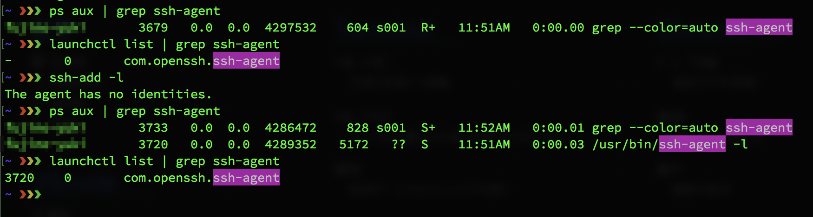

# Mac OS X 以降の ssh-agent 事情

ssh についてもう少し詳しくなれるよう色々と調べたり手を動かしたりと勉強する中で、ssh-agent の Mac での扱い方、挙動に数日悩んだので調べてみました。

## ssh-agent とは

> ssh-agent is a program to hold private keys used for public key authentication (RSA, DSA, ECDSA, Ed25519).
>
> ssh-agentは、公開鍵認証（RSA、DSA、ECDSA、Ed25519）に使用される秘密鍵を保持するプログラムです。
>
> The agent initially does not have any private keys.Keys are added using
ssh(1) (see AddKeysToAgent in ssh_config(5) for details) or ssh-add(1). Multiple identities may be stored in ssh-agent concurrently and ssh(1) will automatically use them if present.
>
> 認証鍵は `ssh-add` もしくは `ssh` （後者は `ssh_config` で `AddKeysToAgent` が設定されている場合）によって `ssh-agent` に追加されます。複数の認証鍵を共に `ssh-agent` に保存することができ、認証鍵が存在している場合 `ssh` はそれらを自動的に使用します。
>
> （[[15] Online man pages | ssh-agent](https://www.freebsd.org/cgi/man.cgi?query=ssh-agent&sektion=1&apropos=0&manpath=FreeBSD+12.1-RELEASE+and+Ports) より翻訳）

ssh-agent という仕組みを利用することで、認証鍵（以降、鍵）をキャッシュする事ができます。それにより ssh 接続時の鍵の指定（`-i`）や、認証の際に尋ねられるパスフレーズの入力をスキップすることができます。

## Mac OS X 以降の ssh-agent の挙動について

普通 ssh-agent は `` eval `ssh-agent` ``等のコマンドで起動させるが Mac OS X の場合は[オンデマンド](https://ja.wikipedia.org/wiki/%E3%82%AA%E3%83%B3%E3%83%87%E3%83%9E%E3%83%B3%E3%83%89)で実行されるため起動の必要はありません。（`ssh-add` がトリガーとなり起動する）  
その為、下記の通り Mac OS X 起動直後は ssh-agent が起動しておらず、`ssh-add -l` をトリガーとして起動している事がわかります。（参考：[[4]](http://roberto-montero.com/blog/using-ssh-agent-mac-os-x), [[5]](https://apple.stackexchange.com/questions/333504/how-to-stop-ssh-agent-from-being-started-on-login-boot) ）



### Mac OS X Leopard 〜 El Capitan まで

Mac OS X Leopard 以降、ssh-agent はシステムの keychain と統合されています。その為 Mac では `ssh-add` によって ssh-agent へ鍵を保存する必要はありません。 ssh 接続の際に一度パスフレーズを入力すると keychain にその鍵の情報を永続的に保存する事ができ、再度 ssh 接続を行う時 keychain から ssh-agent が鍵の情報を読み込むので、鍵指定（`-i`）及びパスフレーズの入力がスキップできます。その他 Mac には `ssh-add` に `-K` オプションが存在しており、こちらのコマンドでも鍵の情報を keychain に保存する事ができます。（参考：[[7]](https://superuser.com/questions/88470/how-to-use-mac-os-x-keychain-with-ssh-keys/269570#269570), [[8]](https://github.com/sequelpro/sequelpro/wiki/SSH-Private-Keys-and-Keychain)）

### macOS Sierra 以降の変更について

結論を先に述べると、keychain や ssh-agent へ鍵が自動的に追加されなくなり、以前のように ssh 接続の際、鍵指定（`-i`）の省略や、パスフレーズ入力のスキップがデフォルトではできなくなりました。以前と概ね同じ挙動を実現するためには下記のように ssh_config を設定する必要があります。

```bash
Host *
  AddKeysToAgent yes
  UseKeychain yes
  IdentityFile ~/.ssh/<key_1>
# IdentityFile ~/.ssh/<key_2> 複数鍵がある場合に行追加可能
```

これは macOS Sierra から OpenSSH が 7.3 になり、`AddKeysToAgent` オプション（デフォルト値 no）が追加された事と、keychain 周りの仕様が変更され `UseKeychain` オプション（デフォルト値 no）が追加された事による影響です。（参考：[[9]](https://github.com/jirsbek/SSH-keys-in-macOS-Sierra-keychain), [[13]](https://developer.apple.com/library/archive/technotes/tn2449/_index.html#//apple_ref/doc/uid/DTS40017589)）

#### AddKeysToAgent

> a private key that is used during authentication will be added to ssh-agent if it is running
>
> 認証時に使用する秘密鍵は、ssh-agent が起動していれば ssh-agent に追加されます
>
>（[[14] OpenSSH 7.2/7.2p1 | Release Notes](https://www.openssh.com/releasenotes.html) より翻訳）

このオプションを yes に設定する事で、ssh 接続時に認証に使用した鍵が ssh-agent に保存されます。つまり ssh 接続に伴い、自動的に認証に使用した鍵が `ssh-add` される事になります。この時、`UseKeychain` が no だった場合、鍵の情報は keychain には保存されず ssh-agent に保存されます。`UseKeychain` が yes だった場合は ssh-agent, keychain の両方に保存されます。

ssh 接続に関して ssh-agent が提供する機能としては下記になります。ただし keychain と異なり永続的ではなく、PCの再起動時に保存されている鍵の情報は消えてしまいます。

* ssh-agent に保存されている鍵の指定（`-i`）の省略
* ssh-agent に保存されている鍵のパスフレーズ入力のスキップ

##### 補足

おそらく `AddKeysToAgent` は __Mac 再起動時に keychain に保存されている鍵の情報を ssh-agent へ自動的に読み込むことはありません。__ [[9]](https://github.com/jirsbek/SSH-keys-in-macOS-Sierra-keychain), [[10]](https://apple.stackexchange.com/questions/254468/macos-sierra-doesn-t-seem-to-remember-ssh-keys-between-reboots/275432#275432) では `AddKeysToAgent` と `UseKeychain` を ssh_config に yes で設定する事で、再起動後に keychain へ既に保存されている鍵の情報を ssh-agent へ自動的に再追加できると汲み取れる説明をされています。

しかし、実際の所 [[9]](https://github.com/jirsbek/SSH-keys-in-macOS-Sierra-keychain), [[10]](https://apple.stackexchange.com/questions/254468/macos-sierra-doesn-t-seem-to-remember-ssh-keys-between-reboots/275432#275432) の通り ssh_config を設定し、鍵が既に複数 keychain に登録されている場合でも mac 再起動後は ssh-agent に鍵が読み込まれていない事を `ssh-add -l` によって確認する事ができます。同様に [[11]](https://blog.elao.com/en/tech/ssh-agent-does-not-automatically-load-passphrases-on-the-osx-sierra-keychain/#using-ssh-config-file), [[12]](https://www.getpagespeed.com/work/proper-use-of-ssh-client-in-mac-os-x) の記事内においても再起動時に ssh-agent へ自動的に鍵を読み込むことは無いと記載されています。したがって `AddKeysToAgent` の挙動は前述（補足の前）で述べた内容のみになりますので、再起動後の ssh 接続において、鍵の指定（`-i`）のスキップには最初の一回は ssh 接続を鍵の指定有りで行う必要があります。

ssh 接続する前に、既に keychain に保存されている鍵の情報を ssh-agent に読み込ませたい場合 `ssh-add -A` の使用で解決する事ができます。その後 `ssh-add -l` で ssh-agent に鍵が追加されていることを確認できます。

#### UseKeychain

> On macOS, specifies whether the system should search for passphrases in the user's keychain when attempting to use a par-ticular key. When the passphrase is provided by the user, this option also specifies whether the passphrase should be stored into the keychain once it has been verified to be correct.
>
> macOSでは、鍵を使用しようとするときに、システムがユーザーのキーチェーン内のパスフレーズを検索するかどうかを指定します。パスフレーズがユーザーから提供された場合、このオプションは、パスフレーズが正しいことが確認された後に、そのパスフレーズをキーチェーンに保存するかどうかも指定します。
>
>（`man ssh_config` の UseKeychain の内容より翻訳）

このオプションを yes に設定する事で、ssh 接続時に認証に使用した鍵が keychain に保存されます。つまり ssh 接続に伴い、自動的に認証に使用した鍵が `ssh-add -K` される事になります。

ssh 接続に関して keychain が提供する機能としては下記になります。keychain は ssh-agent と異なり、鍵をキャッシュしている訳では無いのでパスフレーズのみの提供になります。

* keychain に保存されている鍵のパスフレーズ入力のスキップ

#### IdentityFile

以前から存在するオプションですが、補足として説明しておきます。  
ssh_config の `IdentityFile` に使用する鍵の path を指定しておくことで、ssh 接続の際にその鍵を読み込みます。その為 `IdentityFile` に指定した鍵は ssh 接続時に鍵の指定（`-i`）を省略する事ができます。
は複数指定可能で、記載順に認証を試みます。`IdentityFile`　は複数指定可能で記載順に認証を試みます。

## 参考ドキュメント

* [[1] Qiita | ssh agentをパスフレーズ省略に応用する方法まとめ](https://qiita.com/onokatio/items/397a5899a0ec16c7e60a)
* [[2] Qiita | macOS SierraでSSH鍵のパスフレーズの件](https://qiita.com/d6rkaiz/items/efb085b1a2eb3fddd70e)
* [[3] Qiita | macos Sierra に更新してから、毎回パスフレーズを聞かれてくることに対する対策](https://qiita.com/sho7650/items/6ba6a47dc68fb4d1a5b4)
* [[4] USING SSH AGENT WITH MAC OS X](http://roberto-montero.com/blog/using-ssh-agent-mac-os-x)
* [[5] Ask Different | How to stop ssh-agent from being started on login/boot](https://apple.stackexchange.com/questions/333504/how-to-stop-ssh-agent-from-being-started-on-login-boot)
* [[6] Ask Different | After running "ssh-add -K" to add my SSH key to the Apple Keychain, what is the name and type of entry shown in Keychain Access.app?](https://apple.stackexchange.com/questions/345037/after-running-ssh-add-k-to-add-my-ssh-key-to-the-apple-keychain-what-is-the)
* [[7] SuperUser | How to use Mac OS X Keychain with SSH keys?](https://superuser.com/questions/88470/how-to-use-mac-os-x-keychain-with-ssh-keys/269570#269570)
* [[8] SSH Private Keys and Keychain](https://github.com/sequelpro/sequelpro/wiki/SSH-Private-Keys-and-Keychain)
* [[9] Saving SSH keys in macOS Sierra keychain](https://github.com/jirsbek/SSH-keys-in-macOS-Sierra-keychain)
* [[10] Ask Different | macOS Sierra doesn't seem to remember ssh keys between reboots/275432#275432](https://apple.stackexchange.com/questions/254468/macos-sierra-doesn-t-seem-to-remember-ssh-keys-between-reboots/275432#275432)
* [[11] SSH-agent does not automatically load passphrases on the OSX Sierra keychain during startup](https://blog.elao.com/en/tech/ssh-agent-does-not-automatically-load-passphrases-on-the-osx-sierra-keychain/#using-ssh-config-file)
* [[12] Proper use of SSH client in Mac OS X（Configure OS X SSH client）](https://www.getpagespeed.com/work/proper-use-of-ssh-client-in-mac-os-x)
* [[13] developer.apple.com | OpenSSH updates in macOS 10.12.2](https://developer.apple.com/library/archive/technotes/tn2449/_index.html#//apple_ref/doc/uid/DTS40017589)
* [[14] OpenSSH 7.2/7.2p1 | Release Notes](https://www.openssh.com/releasenotes.html)
* [[15] Online man pages | ssh-agent](https://www.freebsd.org/cgi/man.cgi?query=ssh-agent&sektion=1&apropos=0&manpath=FreeBSD+12.1-RELEASE+and+Ports)
