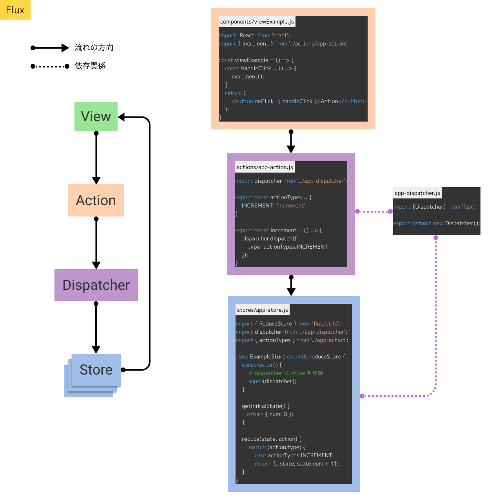
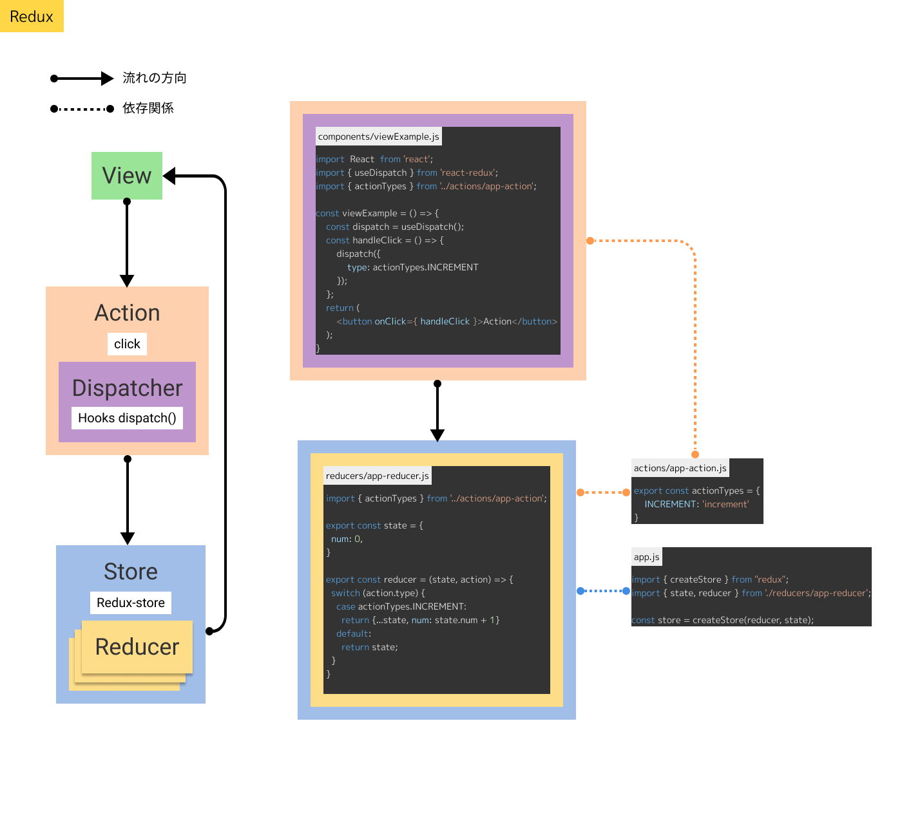
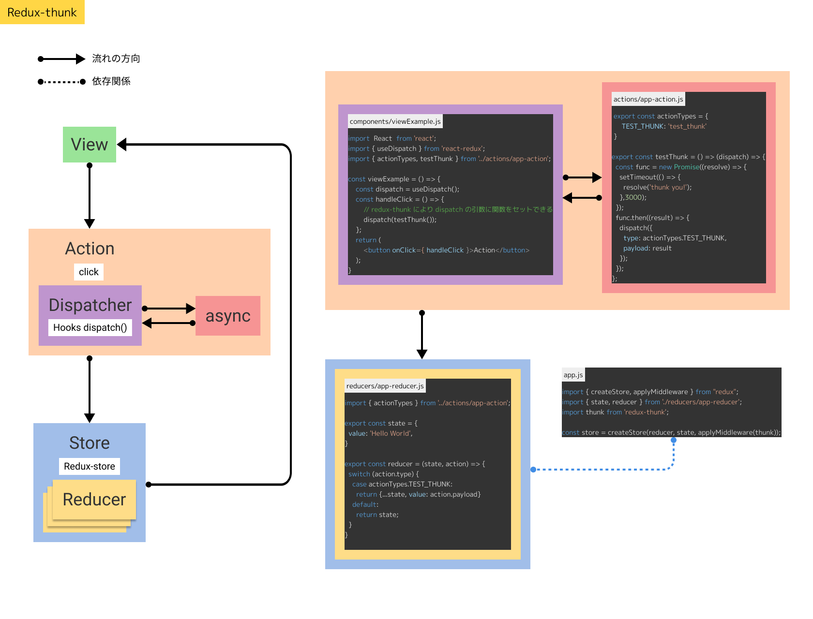
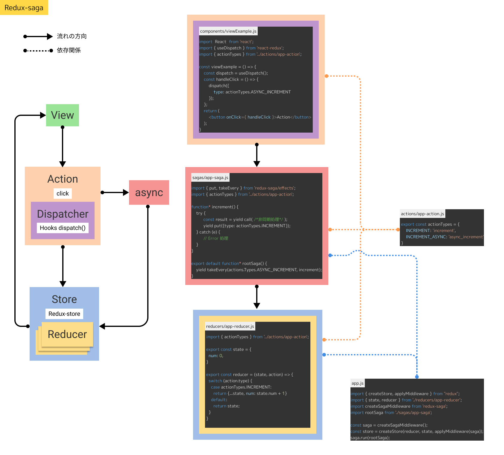
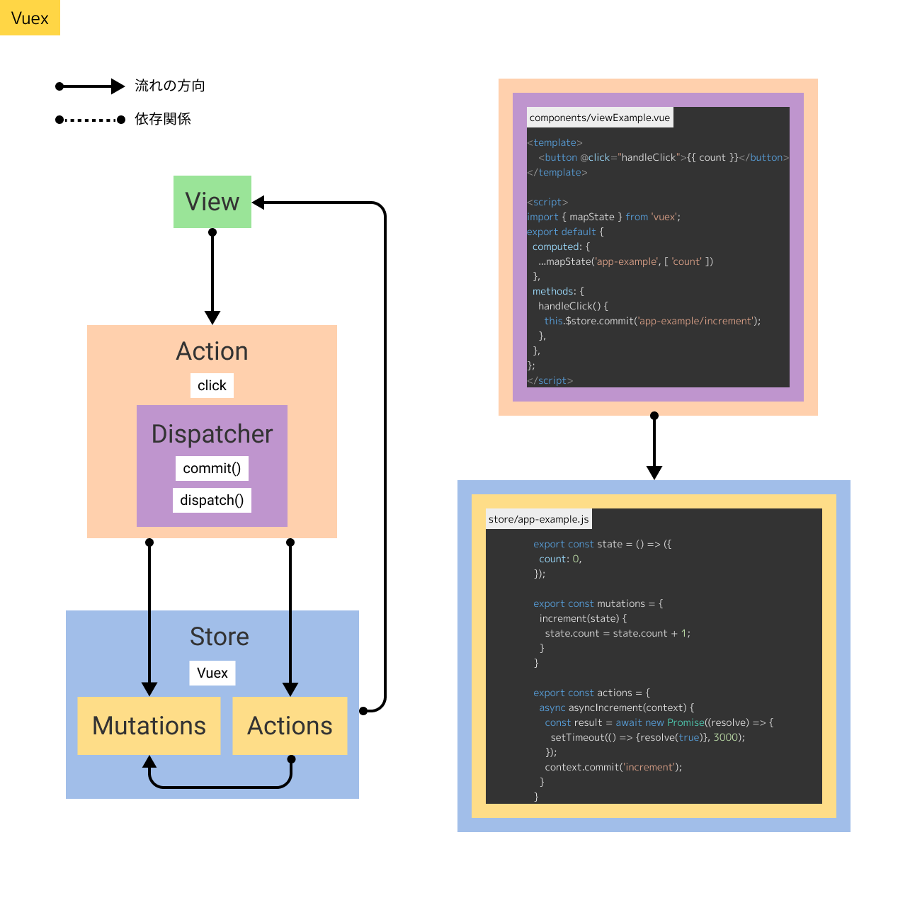

# Data flow diagrams based on flux's of each state management library

View, Action, Dispatcher, Store, +α で表したデータの流れ図です。各イメージの右側は View を除いたデータの流れを実際のコード例で可視化した図になります。

## Flux

## Redux

## Redux-thunk

## Redux-saga

## Vuex

## Reference docs

* [[初心者向け] Fluxを一周する](https://dev.classmethod.jp/articles/flux-introduction-for-beginner/)
* [Qiita: FluxによるReactアプリの状態管理　Flux・FluxUtils編](https://qiita.com/koedamon/items/6bca2375feec89c66359)
* [slideshare: redux と flux を比べてみたときの個人的な感想](https://www.slideshare.net/ssusera7b1a1/reduxflux)
* [Qiita: React Redux の SPA を運用して得られた知見と実装例](https://qiita.com/numanomanu/items/af97312f34cf1388cee6)
* [Qiita: reduxで非同期処理をするいくつかの方法（redux-thunk、redux-saga）](https://qiita.com/muijp/items/63386fd65c7e9f06f5d4)
* [Qiita: redux-sagaを理解できない理由と使い方](https://qiita.com/macotok/items/ec5460ac17f5a20c4735)
* [まだredux-saga使ってないの？](https://akfm.dev/blog/2020-02-28/redux-saga.html)
* [『実践 Redux Saga』 – React, FLUX, Redux, Redux Saga –](https://www.s-arcana.co.jp/blog/2017/03/07/3499)
